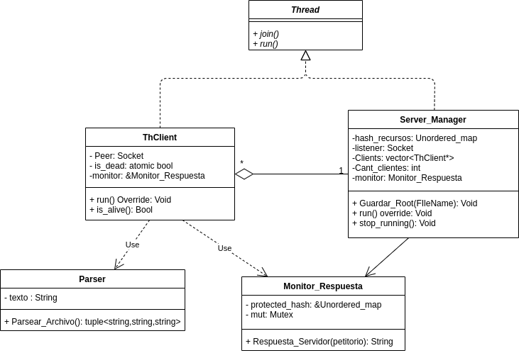
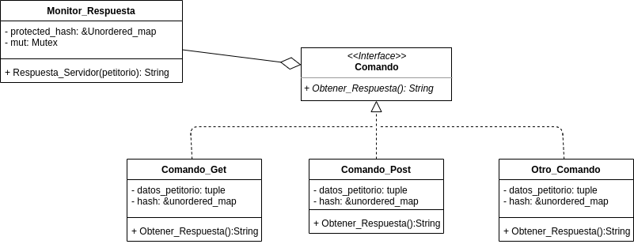

# Trabajo Practico 3: Taller-Pages

*Nombre*: Damian Ganopolsky  
*Padrón*: 101.168  
*Repositorio*: https://github.com/DamianGanopolsky/Taller-Pages

## Introducción
En el siguiente trabajo se tuvo como principal objetivo poner en practica los nuevos conocimientos adquiridos sobre el manejo de multiples clientes desde un servidor, teniendo este recursos compartidos que son accesibles por los clientes. Para realizar esto, tambien se usaron otros conceptos aprendidos en la materia, como lo son el uso de sockets, threads y la proteccion de recursos compartidos, entre otros tantos.

## Descripcion de la resolucion

**Dificultad:Correcta finalizacion del servidor**  
La mayor dificultad la encontre a la hora de cerrar el servidor cuando el usuario ingresa una 'q' por entrada estandar. Esto fue asi, porque al momento de ingresar dicha 'q' hay varios hilos en funcionamiento.  
Para poder hacer que finalice correctamente, voy a explicar secuencialmente como se inicia y finaliza el servidor. En server_main se lanza el hilo "Server_Manager", el cual sera el encargado de aceptar los clientes, despues de lanzar dicho hilo, el hilo "main" se queda esperando una 'q' por entrada estandar. En paralelo, el hilo previamente lanzado sera el encargado del manejo del socket "Listener" por lo que ira aceptando clientes y debido a esto ira generando sockets 'Peer' los cuales movera hacia los ThClient generados para que estos lo manejen.  
El hilo del server_manager se quedara bloqueado en el Accept esperando nuevos clientes, en caso de que este Accept fallara se lanza una excepcion y se llama al destructor de Server_Manager. Una vez ingresada la 'q', el hilo principal llamara a una funcion del Server_Manager, la cual cerrara el socket Listener. Este cierre hara que falle el Accept del listener, por lo que se llamara al destructor de esta clase y se liberaran todos los recursos necesarios.

**Dificultad:Enviado y procesamiento de datos entre el servidor y el cliente**  
Otra dificultad con la que me encontre en este tp fue como enviar y procesar los datos. Esto es asi porque mi clase socket recibe char*, y al mismo tiempo para el parseo y manipulacion de datos se usan las strings de C++ o stringstreams.  
Los datos se fueron enviando usando buffers de 64 Bytes, y el servidor para cada cliente dispone de una string en la cual se fueron appendeando los distintos buffers hasta que el cliente cierre la escritura. Una vez tenida la string resultante del mensaje enviado por el cliente, se paso esta a un StringStream, para poder usar la funcion getline e ir parseando segun el protocolo HTTP el mensaje completo.

### Diagrama de clases
Adjunto los diagramas de clases correspondientes al diseño del servidor, ya que, en este tp el cliente tuvo muy poca responsabilidad y es bastante trivial su diseño.  

  

