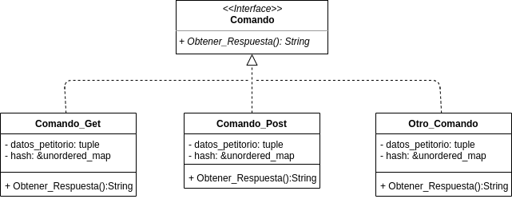

# Trabajo Practico 3: Taller-Pages

*Nombre*: Damian Ganopolsky  
*Padrón*: 101.168  
*Repositorio*: https://github.com/DamianGanopolsky/Taller-Pages

## Introducción
En el siguiente trabajo se tuvo como principal objetivo poner en practica los nuevos conocimientos adquiridos sobre el manejo de multiples clientes desde un servidor, teniendo este recursos compartidos que son accesibles por los clientes. Para realizar esto, tambien se usaron otros conceptos aprendidos en la materia, como lo son el uso de sockets, threads y la proteccion de recursos compartidos, entre otros tantos.

## Diagrama de clases
Adjunto los diagramas de clases correspondientes al diseño del servidor, ya que, en este tp el cliente tuvo muy poca responsabilidad y es bastante trivial su diseño.  

  

